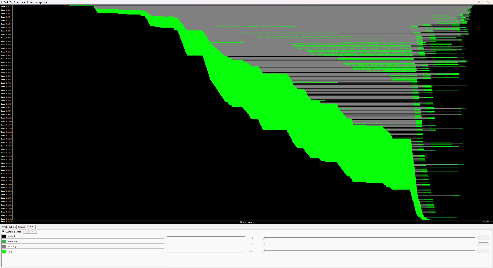

# TraCR

TraCR (pronounced 'tracer') is a user-friendly instrumentation library which can be activated/deactivated via a flag.

It can trace task and/or thread traces. 

The folder `examples/` shows examples on how to use this library.

An example trace in task view is show in the snapshot below:


We also included some python post-processing scripts for visualizations purposes (see `python_scripts/`).

## ovni

The core instrumentation library is currently a modified version of ovni.

To use TraCR one has to first install [ovni](https://gitlab.huaweirc.ch/zrc-von-neumann-lab/runtime-system-innovations/ovni) by typing this:

```
mkdir extern/ovni/build; pushd extern/ovni/build; cmake .. -DCMAKE_INSTALL_PREFIX=$prefix; make -j24; make install; popd
```

with `$prefix` being the wanted install directory for ovni: (e.g. `export prefix=$HOME/src/ovni`)

then add these exports to your `.bashrc` file:

```
# ovni library paths
export PKG_CONFIG_PATH=$PKG_CONFIG_PATH:$prefix/lib/pkgconfig
export PATH=$prefix/bin:$PATH # executables
```

Test if ovni is installed correctly by going into the build folder (`cd extern/ovni/build`)
and run `make test`

For more informations on how to use ovni, go to their [documentations](https://ovni.readthedocs.io/en/master/).

## Paraver

To visualize the traces, one needs to download and install [Paraver](https://tools.bsc.es/paraver):

```
wget https://ftp.tools.bsc.es/wxparaver/wxparaver-4.11.4-Linux_x86_64.tar.bz2
```
