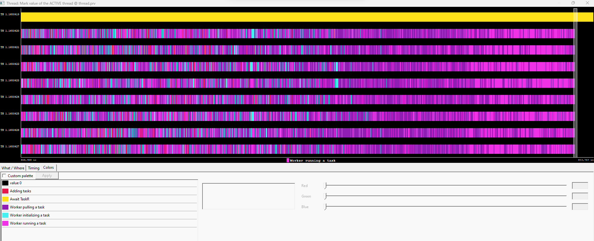

# TraCR

TraCR (pronounced 'tracer') is a user-friendly lightweight instrumentation library that can be activated/deactivated by including this flag: `-DENABLE_INSTRUMENTATION`. If this flag is not added, TraCR instrumentation calls will simply be void function calls (i.e., no overhead).

The flag `-DENABLE_DEBUG` let's you enable the debugging prints of TraCR.

The folder `examples/` contains examples of how to use this library.

An example trace is displayed in the snapshot below:


We have also included some Python post-processing scripts for visualization purposes (see `python_scripts/`).

## Install TraCR

The core instrumentation library is currently ovni.

To use TraCR one has to first install [ovni](https://github.com/bsc-pm/ovni) by typing this:

```
mkdir extern/ovni/build; pushd extern/ovni/build; cmake .. -DCMAKE_INSTALL_PREFIX=$prefix; make -j24; make install; popd
```

with `$prefix` being the wanted install directory for ovni: (e.g. `export prefix=$HOME/library/ovni`)

then add these exports to your `.bashrc` file:

```
# ovni library paths
export PKG_CONFIG_PATH=$PKG_CONFIG_PATH:$HOME/library/ovni/lib/pkgconfig
export PATH=$HOME/library/ovni/bin:$PATH # executables
```

Test if ovni is installed correctly by going into the build folder (`cd tracr/extern/ovni/build`)
and run `make test`

As TraCR is dependent on ovni, please follow the instructions of ovni on their [documentations](https://ovni.readthedocs.io/en/master/).


After ovni has been succesfully installed, install TraCR by doing this:

```
cd tracr
mkdir build
cd build
meson setup .. -DbuildExamples=false
```

### Paraver

To visualize the traces, one needs to download and install [Paraver](https://tools.bsc.es/paraver):

```
wget https://ftp.tools.bsc.es/wxparaver/wxparaver-4.11.4-Linux_x86_64.tar.bz2
```
